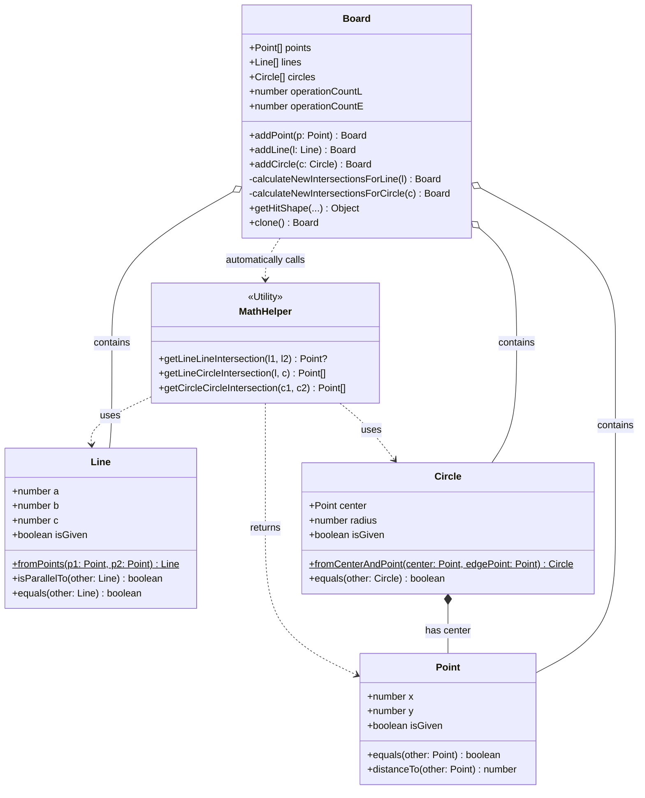

# Euclidea Clone: Model Layer Guide

This document explains in detail how the core **Model Layer (the pure geometry engine)** is structured and how its parts interact.

The Model layer is entirely agnostic to the UI and rendering context. It handles only pure mathematical objects and their geometric intersections.

## 1. Architecture Diagram (Class Diagram)

The following Mermaid diagram illustrates the core classes of the Model layer and their relationships with the `Board` state manager.
(When viewing this file on GitHub, the diagram will render automatically.)

## 2. Core Components Breakdown

### A. Entities (`src/entities.ts`)
These are the fundamental geometric building blocks. They represent pure mathematical values on a Cartesian plane, not pixels on a screen.

* **`Point`**: Holds an `(x, y)` coordinate. It uses an `equals` method that allows for a tiny floating-point tolerance to determine if two points occupy the exact same space.
* **`Line`**: Instead of being defined as a simple segment between two points, a line is defined as an infinite straight line using the standard mathematical equation **`Ax + By + C = 0`**.
  * *Why:* This allows for clean algebraic calculations of intersections across the infinite plane.
* **`Circle`**: Defined simply by a center `Point` and a `radius` number.

*Note:* All Entities have an optional `isGiven` property. This allows the system to distinguish between shapes that are part of the initial level puzzle (which cannot be erased) and shapes drawn by the user.

### B. Math Helper (`src/math.ts`)
These are pure math functions responsible for solving equations to find intersections.

* **`getLineLineIntersection`**: Solves a system of linear equations for two lines (`Ax+By+C=0`) to return a single intersecting `Point` (or null if they are parallel).
* **`getLineCircleIntersection`**: Combines the line equation with the circle equation (`(x-h)^2 + (y-k)^2 = r^2`), solves the resulting quadratic equation, and returns an array of intersection points (0, 1, or 2).
* **`getCircleCircleIntersection`**: Calculates the radical axis between two circles and uses it to find their intersection points.

### C. Board (`src/board.ts`)
The Board acts as the State Manager for the Model layer. It holds the array of all currently active points, lines, and circles.

**Core Mechanism: Auto-Intersection Calculation**
When a tool tells the `Board` to add a new shape via `addLine` or `addCircle`, the `Board` immediately calls the `MathHelper` functions. 
It tests the newly added shape against *every existing shape* on the board. If it calculates an intersection, it **automatically generates a new `Point` and adds it to the board**. These automatic points are what the UI uses for snapping interactions.

**Immutability**
The `Board` manages state immutably. Calling `addPoint` or `addLine` does not push to the existing arrays. Instead, it calls `this.clone()` to create and return a brand-new `Board` instance containing the new elements. This is what makes React state tracking and the Undo stack trivially easy to implement.