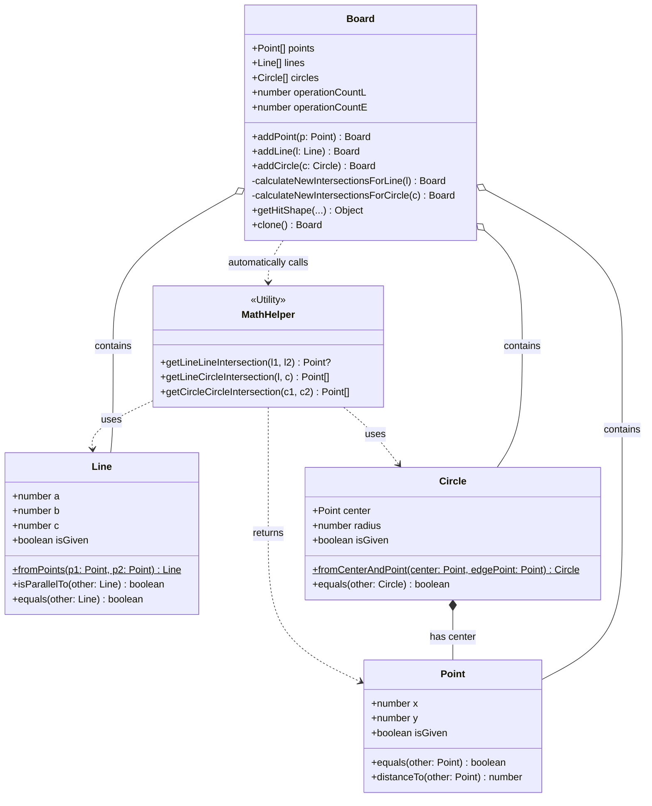

# Euclidea Clone: Model Layer Guide

이 문서는 아키텍처의 핵심인 **Model 레이어 (순수 기하학 엔진)**가 어떻게 구성되어 있고 서로 상호작용하는지 자세히 설명합니다.

Model 레이어는 UI 나 렌더링 방식에 독립적이며, 오직 수학적 객체와 그들 간의 교차점 연산을 담당합니다.

## 1. 아키텍처 다이어그램 (Class Diagram)

아래 다이어그램은 Model 레이어의 핵심 클래스들과 `Board` 객체의 관계를 보여줍니다.
(GitHub에서 이 파일을 열면 자동으로 다이어그램이 렌더링됩니다.)

## 2. 구성 요소 상세 설명

### A. Entities (`src/entities.ts`)
기하학의 기본 단위가 되는 객체들입니다. 화면의 픽셀 좌표가 아닌, 무한한 데카르트 좌표계 위의 순수 수학적 값입니다.

* **`Point (점)`**: `(x, y)` 좌표를 가집니다. 부동소수점 오차를 허용하는 `equals` 메서드를 통해 두 점이 같은 위치에 있는지 판별합니다.
* **`Line (선)`**: 두 점을 연결하는 단순한 선분이 아니라, 수학의 직선 방정식 표준형인 **`Ax + By + C = 0`** 형태의 무한한 직선으로 정의됩니다.
  * *이유:* 무한한 직선끼리의 교차점을 수식으로 깔끔하게 계산하기 위함입니다.
* **`Circle (원)`**: 중심 `Point`와 반지름 `radius`로 정의됩니다.

*참고:* 모든 Entity는 `isGiven`이라는 선택적 속성을 가집니다. 이는 레벨을 시작할 때 초기에 주어지는 도형인지, 사용자가 새롭게 그린 도형인지 구분하는 역할을 합니다. (지우개로 지워지지 않는 기능 등에 사용됨)

### B. Math Helper (`src/math.ts`)
객체들이 서로 만나는 교차점(Intersection)을 찾아내는 순수 수학 함수들입니다.

* **`getLineLineIntersection`**: 두 직선(`Ax+By+C=0`)의 연립방정식을 풀어 교차점 하나를 반환합니다. 평행하면 반환하지 않습니다.
* **`getLineCircleIntersection`**: 직선의 방정식과 원의 방정식(`(x-h)^2 + (y-k)^2 = r^2`)을 연립하여 2차 방정식을 풀고 교차점 배열(0개, 1개, 2개)을 반환합니다.
* **`getCircleCircleIntersection`**: 두 원의 방정식을 이용해 근축(Radical axis)을 구한 뒤, 교차점을 찾습니다.

### C. Board (`src/board.ts`)
Model 레이어의 상태 관리자입니다. 현재 만들어진 모든 점, 선, 원을 들고 있습니다.

**핵심 메커니즘: 자동 교차점 계산 (Auto-Intersection Calculation)**
사용자가 `addLine` 이나 `addCircle`을 통해 새로운 도형을 추가하면, `Board`는 내부적으로 즉시 `MathHelper` 함수들을 호출합니다. 
새로 추가된 선이 기존에 있던 모든 원이나 선과 닿는지 계산하고, 닿는 곳이 있다면 그 위치에 **자동으로 새로운 `Point`를 생성하여 보드에 추가**합니다. 이 점들은 스냅핑(Snapping)의 대상이 됩니다.

**불변성 (Immutability)**
`Board`의 데이터는 직접 수정되지 않습니다. `addPoint` 나 `addLine` 메서드는 기존 배열에 `push`를 하는 대신, **`this.clone()`을 호출하여 완전히 새로운 `Board` 인스턴스를 반환**합니다. 이 덕분에 React에서 상태를 추적하고 Undo 기능을 구현하는 것이 매우 쉬워집니다.